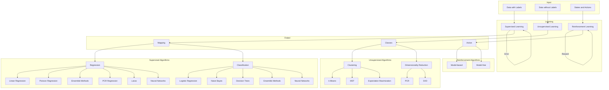

# Machine Learning

```mermaid
flowchart TD
    %% 1. Input Layer
    subgraph Input_Layer [Input]
        I1[Data with Labels]
        I2[Data without Labels]
        I3[States and Actions]
    end

    %% 2. Learning Methods
    subgraph Learning_Process [Learning]
        SL[Supervised Learning]
        UL[Unsupervised Learning]
        RL[Reinforcement Learning]
        
        %% Self-loops (화살표 스타일 변경)
        SL -- Error --> SL
        RL -- Reward --> RL
    end

    %% 3. Output Layer
    subgraph Output_Layer [Output]
        O1[Mapping]
        O2[Classes]
        O3[Action]
    end

    %% Connections Between Layers
    I1 --> SL
    I2 --> UL
    I3 --> RL
    
    SL --> O1
    UL --> O2
    RL --> O3

    %% 4. Detailed Algorithms
    subgraph SL_Details [Supervised Algorithms]
        O1 --> Reg[Regression]
        O1 --> Class[Classification]
        
        Reg --> Reg_L[Linear Regression]
        Reg --> Reg_P[Poisson Regression]
        Reg --> Reg_E[Ensemble Methods]
        Reg --> Reg_PCR[PCR Regression]
        Reg --> Reg_LS[Lasso]
        Reg --> Reg_NN[Neural Networks]
        
        Class --> Class_L[Logistic Regression]
        Class --> Class_NB[Naive Bayes]
        Class --> Class_DT[Decision Trees]
        Class --> Class_E[Ensemble Methods]
        Class --> Class_NN[Neural Networks]
    end

    subgraph UL_Details [Unsupervised Algorithms]
        O2 --> Clust[Clustering]
        O2 --> DimRed[Dimensionality Reduction]
        
        Clust --> C_KM[k-Means]
        Clust --> C_MST[MST]
        Clust --> C_EM[Expectation Maximization]
        
        DimRed --> DR_P[PCR]
        DimRed --> DR_S[SVD]
    end

    subgraph RL_Details [Reinforcement Algorithms]
        O3 --> RL_MB[Model-based]
        O3 --> RL_MF[Model-free]
    end
```