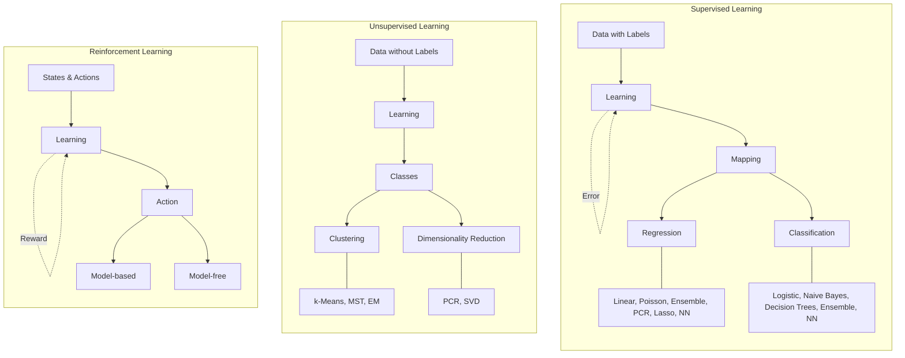

# Machine Learning

```mermaid
flowchart TD
    %% 전체 흐름 방향: 위에서 아래로
    
    subgraph Supervised [Supervised Learning]
        direction TB
        I1[Data with Labels] --> SL[Learning]
        SL -.->|Error| SL
        SL --> O1[Mapping]
        O1 --> Reg[Regression]
        O1 --> Class[Classification]
        
        %% 알고리즘들을 묶어서 표현 (가로 너비 조절)
        Reg --- R_Algos[Linear, Poisson, Ensemble, PCR, Lasso, NN]
        Class --- C_Algos[Logistic, Naive Bayes, Decision Trees, Ensemble, NN]
    end

    subgraph Unsupervised [Unsupervised Learning]
        direction TB
        I2[Data without Labels] --> UL[Learning]
        UL --> O2[Classes]
        O2 --> Clust[Clustering]
        O2 --> DimRed[Dimensionality Reduction]
        
        Clust --- Cl_Algos[k-Means, MST, EM]
        DimRed --- DR_Algos[PCR, SVD]
    end

    subgraph Reinforcement [Reinforcement Learning]
        direction TB
        I3[States & Actions] --> RL[Learning]
        RL -.->|Reward| RL
        RL --> O3[Action]
        O3 --> RL_MB[Model-based]
        O3 --> RL_MF[Model-free]
    end
```