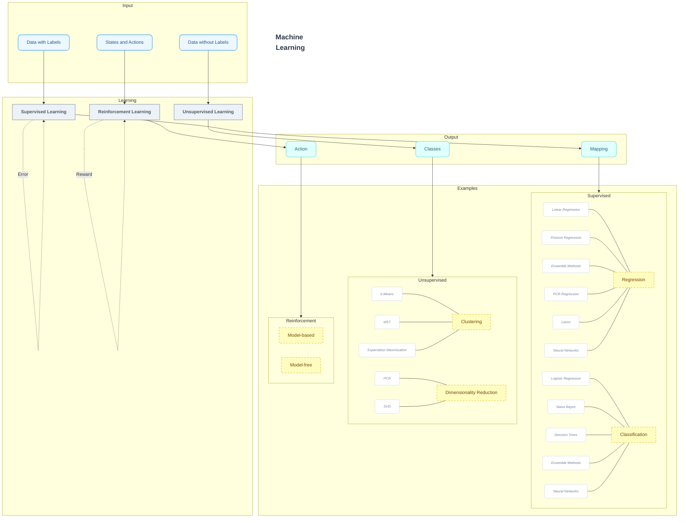

# Machine Learning

```mermaid
flowchart TD
    %% 🌟 전체 제목
    classDef title fill:none,stroke:none,font-size:24px,font-weight:bold,color:#2D3748;
    TitleNode(((Machine Learning)))
    class TitleNode title

    %% 💡 1단계: 입력 데이터 (Input Layer)
    subgraph Input_Layer [Input]
        direction TB
        I1[Data with Labels]
        I2[Data without Labels]
        I3[States and Actions]
    end
    
    %% ⚙️ 2단계: 학습 방법 (Learning methods)
    subgraph Learning_Methods [Learning]
        direction TB
        SL[Supervised Learning]
        UL[Unsupervised Learning]
        RL[Reinforcement Learning]
        
        %% 피드백 루프 (직관적인 흐름)
        SL -. Error .-> SL
        RL -. Reward .-> RL
    end
    
    %% 📤 3단계: 결과물 (Output Layer)
    subgraph Output_Layer [Output]
        direction TB
        O1[Mapping]
        O2[Classes]
        O3[Action]
    end
    
    %% 🔍 4단계: 상세 예시 및 알고리즘 (Detailed Examples)
    subgraph Examples_Layer [Examples]
        %% 지도 학습 상세
        subgraph SL_Examples [Supervised]
            direction LR
            Reg[Regression]
            Class[Classification]
            
            Reg_L[Linear Regression] --- Reg
            Reg_P[Poisson Regression] --- Reg
            Reg_E[Ensemble Methods] --- Reg
            Reg_PCR[PCR Regression] --- Reg
            Reg_LS[Lasso] --- Reg
            Reg_NN[Neural Networks] --- Reg
            
            Class_L[Logistic Regression] --- Class
            Class_NB[Naive Bayes] --- Class
            Class_DT[Decision Trees] --- Class
            Class_E[Ensemble Methods] --- Class
            Class_NN[Neural Networks] --- Class
        end
        
        %% 비지도 학습 상세
        subgraph UL_Examples [Unsupervised]
            direction LR
            Clust[Clustering]
            DimRed[Dimensionality Reduction]
            
            C_KM[k-Means] --- Clust
            C_MST[MST] --- Clust
            C_EM[Expectation Maximization] --- Clust
            
            DR_P[PCR] --- DimRed
            DR_S[SVD] --- DimRed
        end
        
        %% 강화 학습 상세
        subgraph RL_Examples [Reinforcement]
            direction LR
            RL_MB[Model-based]
            RL_MF[Model-free]
        end
    end
    
    %% 🔗 전체 연결 (최소화 및 명확화)
    I1 --> SL
    I2 --> UL
    I3 --> RL
    
    SL --> O1
    UL --> O2
    RL --> O3
    
    O1 --> SL_Examples
    O2 --> UL_Examples
    O3 --> RL_Examples
    
    %% 🎨 스타일 정의 (classDef)
    classDef inputNode fill:#EBF8FF,stroke:#63B3ED,stroke-width:2px,rx:10,ry:10,color:#2C5282;
    classDef learningNode fill:#EDF2F7,stroke:#A0AEC0,stroke-width:2px,color:#4A5568,font-weight:bold;
    classDef outputNode fill:#E0FFFF,stroke:#81E6D9,stroke-width:2px,rx:10,ry:10,color:#285E61;
    classDef exampleCatNode fill:#FEFCBF,stroke:#ECC94B,stroke-width:2px,stroke-dasharray: 5 5,color:#744210;
    classDef exampleNode fill:#FFFFFF,stroke:#CBD5E0,stroke-width:1px,rx:5,ry:5,color:#718096,font-style:italic,font-size:12px;
    
    %% 스타일 적용 (class)
    class I1,I2,I3 inputNode
    class SL,UL,RL learningNode
    class O1,O2,O3 outputNode
    class Reg,Class,Clust,DimRed,RL_MB,RL_MF exampleCatNode
    class Reg_L,Reg_P,Reg_E,Reg_PCR,Reg_LS,Reg_NN,Class_L,Class_NB,Class_DT,Class_E,Class_NN,C_KM,C_MST,C_EM,DR_P,DR_S exampleNode
    
    %% 서브그래프 스타일
    %% 🎨 Input_Layer 서브그래프 배경색 변경
    subgraph Input_Layer
        style Input_Layer fill:#F0F9FF,stroke:none
    end
    %% 🎨 Learning_Methods 서브그래프 배경색 변경
    subgraph Learning_Methods
        style Learning_Methods fill:#F7FAFC,stroke:none
    end
    %% 🎨 Output_Layer 서브그래프 배경색 변경
    subgraph Output_Layer
        style Output_Layer fill:#F0FFF4,stroke:none
    end
    %% 🎨 Examples_Layer 서브그래프 배경색 변경
    subgraph Examples_Layer
        style Examples_Layer fill:#FFFEEE,stroke:none
    end
```